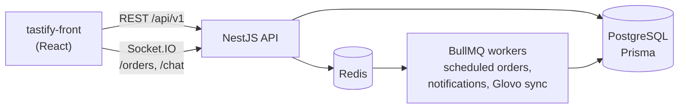

# Tastify API — Restaurant Ordering Backend

REST and WebSocket API for a restaurant ordering app: customer accounts, menu, instant and scheduled orders, live order tracking, customer–staff chat, and courier delivery. It powers the [tastify-front](https://github.com/Davitxxdavit/tastify-front) web app.

Built with **NestJS, PostgreSQL (Prisma), Redis, BullMQ, and Socket.IO**, with 112 unit and end-to-end tests.



## Features

- **Authentication**: JWT access and refresh tokens; separate logins for customers and staff
- **Roles**: admin, kitchen, and courier staff roles, enforced with guards
- **Menu**: categories, items, and modifiers, with image upload
- **Orders**: instant or scheduled orders; scheduled orders are released on time by a BullMQ worker
- **Live updates**: Socket.IO events for every order status change
- **Chat**: real-time chat between a customer and staff about an order
- **Delivery**: courier task assignment and status tracking; Glovo integration is mocked
- **Payments**: Stripe and Adyen endpoints and webhooks (placeholder integrations)
- **Admin**: daily sales analytics, user list, order chat history
- **Operations**: health and readiness checks, Prometheus metrics, rate limiting, Helmet, compression
- **API docs**: Swagger UI at `/api/docs`

## Tech stack

| Area | Tools |
| --- | --- |
| Framework | NestJS 10, TypeScript |
| Database | PostgreSQL, Prisma 5 |
| Cache and queues | Redis, BullMQ |
| Real time | Socket.IO with Redis adapter |
| Auth | Passport, JWT, bcrypt |
| Validation | class-validator, Joi config schema |
| Testing | Jest, Supertest |
| Deployment | Docker, Render Blueprint (`render.yaml`) |

## API overview

All routes are prefixed with `/api/v1`. The full, interactive list is in Swagger at `/api/docs`.

| Area | Endpoints |
| --- | --- |
| Auth | `POST /auth/register`, `POST /auth/login`, `POST /auth/staff/login`, `POST /auth/refresh` |
| Menu | `GET/POST /menu/categories`, `GET/POST /menu/items`, `POST /menu/items/upload-image`, `GET /menu/items/:itemId/modifiers`, `POST/PUT/DELETE /menu/modifiers` |
| Orders | `POST /orders`, `GET /orders`, `GET /orders/:id`, `PATCH /orders/:id/cancel`, `PATCH /orders/:id/status`, `GET /orders/admin/all` |
| Users | `GET /users/profile`, `GET/POST/PUT/DELETE /users/addresses` |
| Staff | `GET/POST /staff`, `GET/PUT/DELETE /staff/:id` |
| Chat | `GET /chat/:orderId`, `POST /chat/:orderId` |
| Delivery | `POST /delivery/tasks/:orderId`, `PATCH /delivery/tasks/:orderId/assign`, `PATCH /delivery/tasks/:orderId/status`, `GET /delivery/tasks`, `GET /delivery/tasks/my` |
| Payments | `POST /payments/intent`, `POST /payments/webhooks/stripe`, `POST /payments/webhooks/adyen` |
| Admin | `GET /admin/analytics/daily-sales`, `GET /admin/users`, `GET /admin/chat/:orderId` |
| Health | `GET /health`, `/health/live`, `/health/ready`, `/health/db`, `/health/redis`, `GET /metrics` |

### WebSocket events

| Namespace | Client sends | Server sends |
| --- | --- | --- |
| `/orders` | `join_order_room` | `order_created`, `order_updated`, `order_cancelled`, `order_ready`, `order_delivering`, `order_completed` |
| `/chat` | `join_chat_room`, `send_chat_message`, `request_chat_history` | `chat_message`, `chat_history` |

## Run locally

Requires Node.js 18+, plus PostgreSQL and Redis (the included `docker-compose.yml` starts both).

```bash
npm install
cp .env.example .env          # then fill in DATABASE_URL and the JWT secrets
docker compose up -d          # PostgreSQL + Redis
npm run prisma:generate
npm run prisma:migrate
npm run start:dev
```

The API runs at http://localhost:3000/api/v1 and Swagger at http://localhost:3000/api/docs.

On first start, the app creates an admin account if none exists. Set `ADMIN_PHONE` and `ADMIN_PASSWORD` to choose its credentials; in development they default to `555000001` / `admin123`, and in production no admin is created unless `ADMIN_PASSWORD` is set.

### Tests

```bash
npm test            # unit tests
npm run test:e2e    # end-to-end tests (needs PostgreSQL and Redis)
npm run test:cov    # coverage report
```

## Project structure

```text
src/
├── main.ts          bootstrap, global prefix, Swagger
├── config/          typed configuration and Joi validation
├── database/        Prisma service, schema sync, first-run seeding
├── modules/         auth, users, staff, menu, orders, chat, delivery,
│                    glovo, payments, notifications, admin
├── websockets/      /orders and /chat gateways
├── queues/          BullMQ processors
├── health/          health and readiness checks
├── metrics/         Prometheus metrics
└── common/          guards, decorators, filters, interceptors
prisma/schema.prisma database schema
test/                end-to-end tests
docs/                setup and Render deployment guides
```

## Deployment

The repository includes a Dockerfile and a Render Blueprint (`render.yaml`) that provisions the API, PostgreSQL, and Redis. See [docs/RENDER_DEPLOYMENT.md](docs/RENDER_DEPLOYMENT.md) for the full guide and [docs/SETUP.md](docs/SETUP.md) for local setup.
